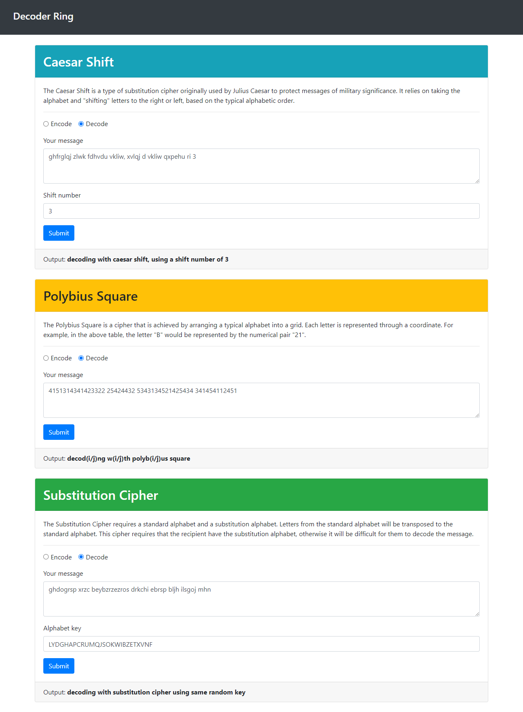
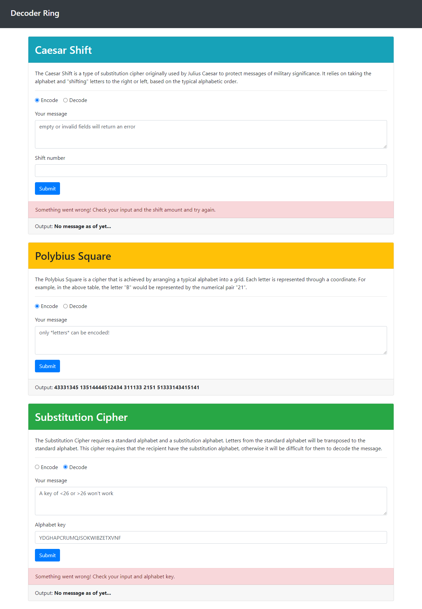
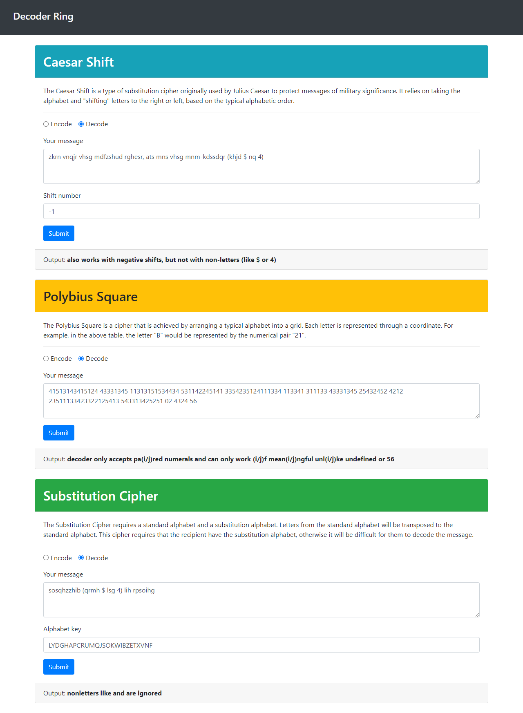

# Decoder ring

## Link

Here is the app running on [GitHub Pages](https://craig-r-kelly.github.io/Decoder-ring/).

## Purpose

This is just a fun app which can encode and decode using three methods:  the "Caesar Shift", the "Polybius Square", and the "Substitution Cypher."

With this project I employed more fully the concept of "Test Driven Design," wrote the tests, and then write the code for several different algorithms.

## Explanation of codes

### Caesar shift
The Caesar shift is a type of substitution cipher originally used by Julius Caesar to protect messages of military significance. It relies on taking the alphabet and "shifting" letters to the right or left, based on the typical alphabetic order.
For example, if you were to "shift" the alphabet to the right by 3, the letter `C` would become `F`, `A` become `D`, and `B` become `E`, so `CAB` would become `FDE`.
When decoding the message, you need to know the number the original message was shifted by so that you can shift in the opposite direction.

### Polybius square
The Polybius square is a cipher that is achieved by arranging a typical alphabet into a grid. Each letter is represented through a coordinate. For example, in the above table, the letter `D` would be represented by the numerical pair `41`, `O` by `43`, and `G` by `22`, so `DOG` would be represented by `414322`.
Typically, it is possible to arrange the letters however you like and read off the coordinates in whatever direction you like. In this example, the grid will be arranged as above and coordinates will be read by comparing the first digit to the number on the top of the table and the second digit to that on the left.
When decoding the message, each pair of numbers is translated using the coordinates.

### Substitution cipher
The substitution cipher requires a standard alphabet and a substitution alphabet. Letters from the standard alphabet will be transposed to the substitution alphabet. This cipher requires that the recipient have the substitution alphabet, otherwise it will be difficult for them to decode the message.
To decrypt this code, you would simply take the result and transpose back from the substitution alphabet to the standard alphabet.
In the example below, the top row of letters shows the original letters to be encrypted.  The bottom row, or "key", shows their respective substitutions.  `C` would become `Y`, `A` become `X`, and `T` become `J`, so `CAT` would become `YXJ`.  But this is just an example; any key of 26 unique characters will work.
 

## Tools

* JavaScript with Node 
* Mocha testing framework 
* Chai assertion library

## Screen shots

### Encoding:

### Decoding:

### Errors and invalid input:

### More invalid input:

